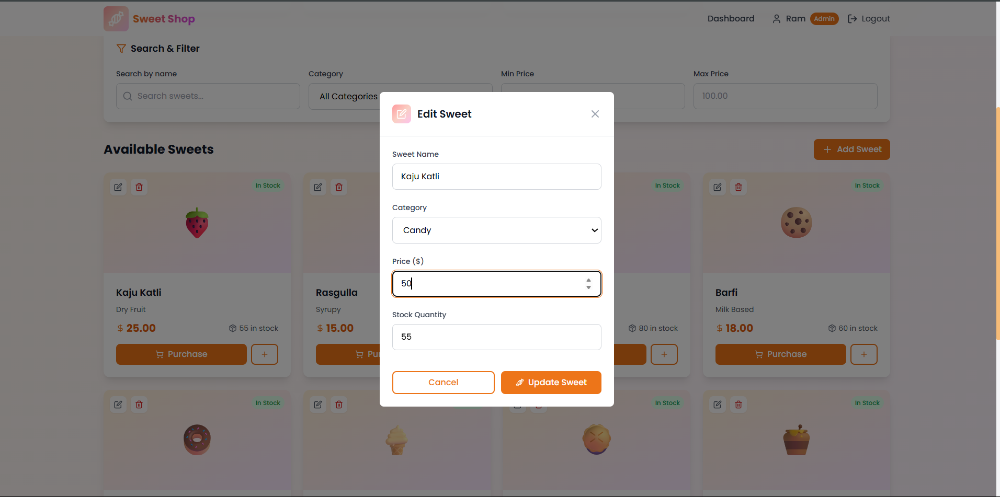

# Sweet Shop Management System

The Sweet Shop Management System is a full-stack web application designed to help manage inventory, user authentication, and daily operations in a sweet shop. It provides a seamless interface for users (customers) to view and purchase sweets, and for admins to manage inventory, restock items, and analyze stock status.

---

## Table of Contents

* [Features](#features)
* [Tech Stack](#tech-stack)
* [Project Structure](#project-structure)
* [Getting Started](#getting-started)
  * [Backend Setup](#backend-setup)
  * [Frontend Setup](#frontend-setup)
* [Testing & Test Coverage](#testing--test-coverage)
* [Screenshots](#screenshots)
* [My AI Usage](#my-ai-usage)
* [License](#license)

---

## Features

* **Role-Based Authentication**
  * Separate login flow for admin and user
  * JWT-based secure session management

* **Inventory Management**
  * Admins can restock sweets
  * Users can purchase sweets
  * Inventory automatically updates in real-time

* **CRUD Operations for Sweets**
  * Admins can add, delete, or update sweet items

* **Filtering and Search**
  * Users can filter sweets by name, price, or category
  * Instant search suggestions

---

## API Endpoints

### Authentication
* `POST /api/auth/register` - User registration
* `POST /api/auth/login` - User authentication

### Sweets Management (Protected)
* `POST /api/sweets` - Add a new sweet
* `GET /api/sweets` - View all available sweets
* `GET /api/sweets/search` - Search sweets by name, category, or price range
* `PUT /api/sweets/:id` - Update sweet details
* `DELETE /api/sweets/:id` - Delete a sweet (Admin only)

### Inventory Operations (Protected)
* `POST /api/sweets/:id/purchase` - Purchase sweet, decrease quantity
* `POST /api/sweets/:id/restock` - Restock sweet, increase quantity (Admin only)

### Data Model
Each sweet contains:
* Unique ID
* Name
* Category
* Price
* Quantity in stock

---

## Tech Stack

### Frontend:

* React.js with functional components
* React Router for page navigation
* Tailwind CSS for modern responsive styling
* Context API for state management
* Axios for API requests

### Backend:

* Flask with Blueprints for modular architecture
* SQLAlchemy for ORM-based DB operations
* Flask-JWT-Extended for secure JWT-based authentication
* SQLite for development (easily switchable to PostgreSQL/MySQL)
* CORS, dotenv, marshmallow for request handling and validation

---

## Project Structure

```bash
sweet-shop-management/
│
├── backend/
│   ├── app/
│   │   ├── routes/
│   │   ├── services/
│   │   ├── utils/
│   │   ├── __init__.py
│   │   ├── config.py
│   │   └── models.py
│   ├── tests/
│   ├── requirements.txt
│   ├── init_db.py
│   ├── run.py
│   └── test_setup.py
│
├── frontend/
│   ├── src/
│   │   ├── components/
│   │   ├── pages/
│   │   ├── contexts/
│   │   ├── services/
│   │   ├── test/
│   │   ├── App.jsx
│   │   ├── main.jsx
│   │   └── index.css
│   ├── index.html
│   ├── package-lock.json
│   ├── package.json
│   ├── postcss.config
│   ├── vite.config.js
│   └── tailwind.config.js
├── .gitignore
├── README.md
│ 
```

---


## Getting Started

### Clone the Repository

```bash
git clone https://github.com/rbpata/Sweet-Shop-TDD.git
cd sweet-shop-TDD
```

* ###  Backend Setup

```bash
cd backend
python -m venv venv
source venv/bin/activate    # or `venv\Scripts\activate` on Windows
pip install -r requirements.txt
python init_db.py           # Initializes database and inserts sample data
python run.py               # Starts backend server at http://localhost:5000
```

* ### Frontend Setup

```bash
cd frontend
npm install
npm run dev                 # Starts frontend server at http://localhost:5173
```

---

> The default admin login is:
> **Username:** admin | **Password:** admin123
>
> The default user login is:
> **Username:** user | **Password:** user123

---

## Testing & Test Coverage

### ✅ Backend Tests

Tests are written using `pytest`. Covered modules include:

* Auth endpoints (login, protected routes)
* Inventory operations (purchase, restock)
* Sweets operations (CRUD)

To run backend tests:

```bash
cd backend
pytest tests/
```

**Test Report Summary:**

| Test Area        | Status    | Coverage |
| ---------------- | --------  | -------- |
| Auth Routes      | ✅ Passed | 80%     |
| Inventory Routes | ✅ Passed | 100%     |
| Sweet Routes     | ✅ Passed | 100%     |

### ✅ Frontend Tests

Frontend tests use **Vitest** for mocking and unit testing.

* API mocking using `vi.mock()`
* Coverage includes:

  * Contexts (AuthContext)
  * Component rendering and state changes
  * Purchase/Restock API calls

To run:

```bash
cd frontend
npm run test
```

**Test Report Summary:**


| Test Area          | Status    | Coverage |
| ------------------ | --------  | -------- |
| Auth Logic         | ✅ Passed | 100%     |
| API Integration    | ✅ Passed | 100%     |

All 23 tests passed across auth.test.js and api.test.js using Vitest with v8 coverage engine.


---

## Screenshots

### Login Pages

| User Login                                | User Registration                                 |
| ----------------------------------------- | ------------------------------------------- |
|  |  |

### Sweet List & Inventory Restocking

| Sweet List View                           | Inventory Restocking (Admin)                            |
| ----------------------------------------- | ------------------------------------------------------- |
|  |  |

### Purchase Flow & Search Filter

| Modifying Sweets                                | Search & Filter Feature                         |
| ----------------------------------------------- | ----------------------------------------------- |
|  |  |

---


## My AI Usage

### Tools Utilized

* **ChatGPT (OpenAI)**
* **Cursor (AI-powered IDE – VS Code Plugin)**
* **Claude (Anthropic)**

---

### How These Tools Were Integrated Into My Workflow

#### **ChatGPT (OpenAI)**

ChatGPT served as a reliable reference and pair programmer throughout backend development:

* Provided architectural guidance for Flask backend design, including modular structure with Blueprints and JWT-based authentication.
* Helped resolve SQLAlchemy model relationships, database handling, and CORS configuration questions.
* Assisted in refining testing strategies and error-handling against API design best practices.
* All recommendations were critically evaluated and refined to meet production standards.

#### **Cursor (AI-Powered Coding Assistant in VS Code)**

Cursor enhanced frontend productivity through context-aware code generation:

* Bootstrapped reusable React components like `SweetCard`, `Navbar`, and page layouts, reducing boilerplate code.
* Streamlined TailwindCSS class composition and layout prototyping for faster UI development.
* Generated context-sensitive logic for form handling, authentication flows, and routing with `react-router-dom`.
* Minimized development friction by handling repetitive UI tasks.

#### **Claude (Anthropic)**

Claude served as a thoughtful co-reviewer during final development stages:

* Reviewed unit and integration tests, focusing on error handling and test case clarity.
* Improved inline documentation, commit messages, and README structure and tone.
* Enhanced semantic accuracy of error messages and validation logic.
* Provided brainstorming support and refactoring alternatives for stronger solutions.

---

### Reflections on AI Integration

AI integration served as professional augmentation rather than shortcuts, acting as development accelerators through context-sensitive suggestions and rapid iteration support.

* **ChatGPT** provided strategic architectural and debugging insight for backend development.
* **Cursor** improved frontend velocity while maintaining code quality through validated scaffolding.
* **Claude** elevated codebase clarity and documentation coherence as an editorial companion.

---

## License

This project is licensed under the **MIT License**. See `LICENSE` for more details.
